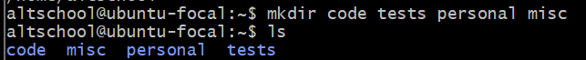

# Assignment update

1.`Your login name: altschool i.e., home directory /home/altschool`: 

2.`The home directory contains the following sub-directories: code, tests, personal, misc Unless otherwise specified, you are running commands from the home directory`: 

a.`Change directory to the tests directory using absolute pathname`:

b.`Change directory to the tests directory using relative pathname`:

c.`Use echo command to create a file named fileA with text content ‘Hello A’ in the misc directory`:

d.`Create an empty file named fileB in the misc directory. Populate the file with a dummy content afterwards`:

e.`Copy contents of fileA into fileC`:

f.`Move contents of fileB into fileD`:

g.`Create a tar archive called misc.tar for the contents of misc directory`:

h.`Compress the tar archive to create a misc.tar.gz file`:

I.`Create a user and force the user to change his/her password upon login`:

J. `Lock a users password`: 

K. `Create a user with no login shell`:

L. `Disable password based authentication for ssh`:

M. `Disable root login for ssh`:
